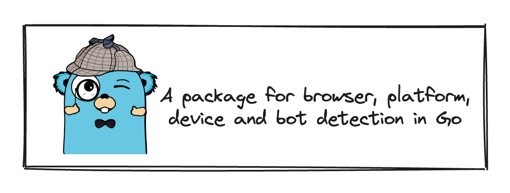

# Browser



## Why?

I wanted a package to detect the browser, device and platform from the user agent string. I found nothing similar in Go (Golang), so I wrote my package.

### Inspiration

This package is inspired by the ruby gem [fnando/browser](https://github.com/fnando/browser). I have used the ruby gem in my previous projects and I really liked it. All the credit goes to the author of the ruby gem who has done a great job. After much procrastination, I finally decided to write a similar package in Go.

## Design

I have tried to keep the architecture as similar as possible to the ruby gem. But made changes where I felt it was necessary as per the Go standards.

The package is divided into three parts:

- **browser**: This package contains the code to detect the browser.
- **device**: This package contains the code to detect the device from the user agent string.
- **platform**: This package contains the code to detect the platform from the user agent string.

### Browser

A `Matcher` interface defines a matching behaviour for a user agent string.

```go
type Matchers interface {
    Match() bool
    Name() string
}
```

`BrowserMatchers` interface matches the user agent string with the browser. Any new browser can be added by implementing the `BrowserMatchers` interface.

```go
type BrowserMatcher interface {
    Matcher
    Version() string // FullVersion returns the full version of the browser.
}
```

### Device

`DeviceMatchers` interface matches the user agent string with the device. Any new device can be added by implementing the `DeviceMatchers` interface.

```go
type DeviceMatcher interface {
    Matcher
}
```

### Platform

`PlatformMatchers` interface matches the user agent string with the platform. Any new platform can be added by implementing the `PlatformMatchers` interface.

```go
type PlatformMatcher interface {
    Matcher
    Version() string // Version returns the version of the platform.
}
```
